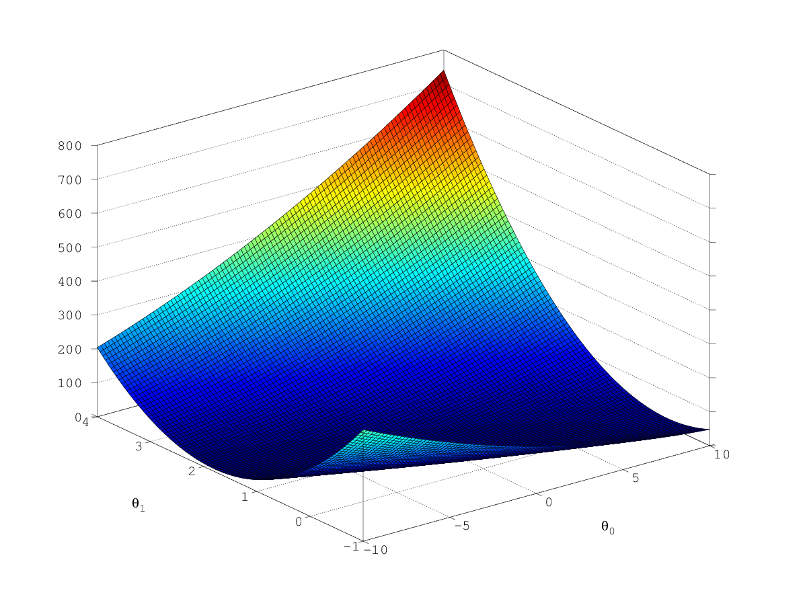
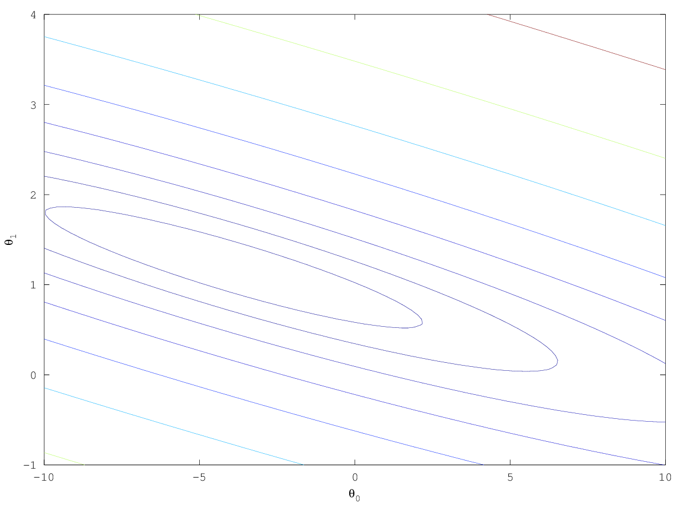

= Machine Learning Week 1
:icons: font
:toc: left
:stem: latexmath
:numbered:
:source-highlighter: prettify

== Definition

Derivative: 导数

calculus: 微积分

tangent: 切线

== NOTES

在Other Materials里面提到了梯度下降，以及 http://math.stackexchange.com/questions/70728/partial-derivative-in-gradient-descent-for-two-variables/189792#189792[对应的证明]

其实就是对latexmath:[\theta]进行求导。

cost function: 

latexmath:[J(\theta_0,\theta_1) = \frac{1}{2m}\displaystyle\sum_{i=1}^m(h_\theta(x^{(i)}) - y^{(i)})^2]

对latexmath:[\theta_0]求导可得:

latexmath:[\frac{\partial}{\partial \theta_0} J(\theta_0,\theta_1) \\ 
= \frac{\partial}{\partial \theta_0} \frac{1}{2m} \sum\limits_{i=1}^{m}(h_\theta(x^{(i)}) - y^{(i)})^2 \\ 
= \frac{1}{2m} \times 2 \sum\limits_{i=1}^{m}(h_\theta(x^{(i)}) - y^{(i)})^{(2-1)} \times
 \frac{\partial}{\partial \theta_0}(\theta_0 + \theta_1 x^{(i)} - y^{(i)} ) \\
= \frac{1}{m} \sum\limits_{i=1}^{m}(h_\theta(x^{(i)}) - y^{(i)} )
]

则对应对梯度下降公式为:

latexmath:[\theta_0 := \theta_0 - \alpha \frac{1}{m} \sum\limits_{i=1}^{m}(h_\theta(x^{(i)} - y^{(i)}))]

对latexmath:[\theta_1]求导可得:

latexmath:[\frac{\partial}{\partial \theta_1} J(\theta_0,\theta_1) \\ 
= \frac{\partial}{\partial \theta_1} \frac{1}{2m} \sum\limits_{i=1}^{m}(h_\theta(x^{(i)}) - y^{(i)})^2 \\ 
= \frac{1}{2m} \times 2 \sum\limits_{i=1}^{m}(h_\theta(x^{(i)}) - y^{(i)})^{(2-1)} \times
 \frac{\partial}{\partial \theta_1}(\theta_0 + \theta_1 x^{(i)} - y^{(i)} ) \\
= \frac{1}{m} \sum\limits_{i=1}^{m}(h_\theta(x^{(i)}) - y^{(i)} ) x^{(i)}
]

则对应对梯度下降公式为:

latexmath:[\theta_1 := \theta_1 - \alpha \frac{1}{m} \sum\limits_{i=1}^{m}(h_\theta(x^{(i)} - y^{(i)})) x^{(i)} ]

在Cost Function - Intuition II 中提到了contour plot.

我理解就是将latexmath:[J(\theta_0, \theta_1)=t],关于latexmath:[\theta_0,\theta_1]的函数画出来。比如如下3D plot。

contour plot就是取Z轴上latexmath:[J=t]的横截面，切割出来的曲线就是contour.

在通俗一点就是等高线。

推导一下公式：

latexmath:[J(\theta_0,\theta_1)=\frac{1}{2m}\displaystyle\sum_{i=1}^m(h_\theta(x^{(i)}) - y^{(i)})^2 \\
= \frac{1}{2m}\sum\limits_{i=1}^{m}(\theta_0 + \theta_1 x^{(i)} - y^{(i)} )^2 \\
= \frac{1}{2m} \sum\limits_{i=1}^{m}(\theta_{0}^{2} + (x^{(i)})^2\theta_{1}^2 + (y^{(i)})^2 + 
2x^{(i)}\theta_0\theta_1 - 2y^{(i)}\theta_0 - 2x^{(i)}y^{(i)}\theta_1) \\
= \frac{\theta_{0}^2}{2} + \frac{\theta_{1}^2}{2m}\sum\limits_{i=1}^{m}(x^{(i)})^2 + 
\frac{\theta_0\theta_1}{m}\sum\limits_{i=1}^{m}(x^{(i)}) - \frac{\theta_0}{m}\sum\limits_{i=1}^{m}(y^{(i)})
- \frac{\theta_1}{m}\sum\limits_{i=1}^{m}(x^{(i)}y^{(i)}) + \frac{1}{2m}\sum\limits_{i=1}^{m}(y^{(i)})^2
]

很明显，当latexmath:[J(\theta_0,\theta_1)=t]，latexmath:[\theta_0]和latexmath:[\theta_1]为坐标时，在2维坐标系上是个椭圆。对应着3D plot的横切面。

安装octave需要注意，找不到terminal，可以尝试如下命令：
[source,shell]
----
brew uninstall gnuplot
brew install gnuplot --with-x11
octave:>setenv ("GNUTERM", "X11")
----

