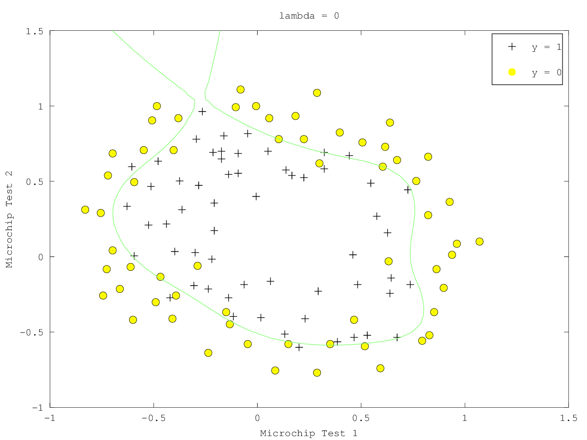

= Machine Learning Week 3
:icons: font
:toc: left
:stem: latexmath
:numbered:
:source-highlighter: prettify

== ISSUE

. 为什么lr的最小二乘损失函数是non-convex的。画出其图像
. 为什么latexmath:[\theta]小了，就不over fitting?

== NOTES

http://www.krizka.net/2009/11/06/creating-animations-with-octave/[octive绘制gif]

http://www.it610.com/article/1497619.htm[一些lr的解释]

http://www.it610.com/article/1497619.htm[机器学习基石的一些总结]

本周其实涉及的内容很多，需要慢慢整理。除了上面提到的2个问题以外，还有如下问题，可能需要看了台大的机器学习基石和PRML等更多资料来完善，现在还是没有系统的理解。

损失函数是怎么来的？跟概率有关系，好像来源于人口增长。

正则化的意义。
